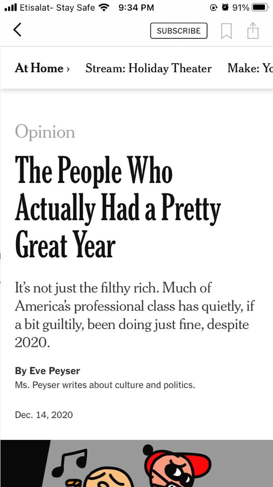
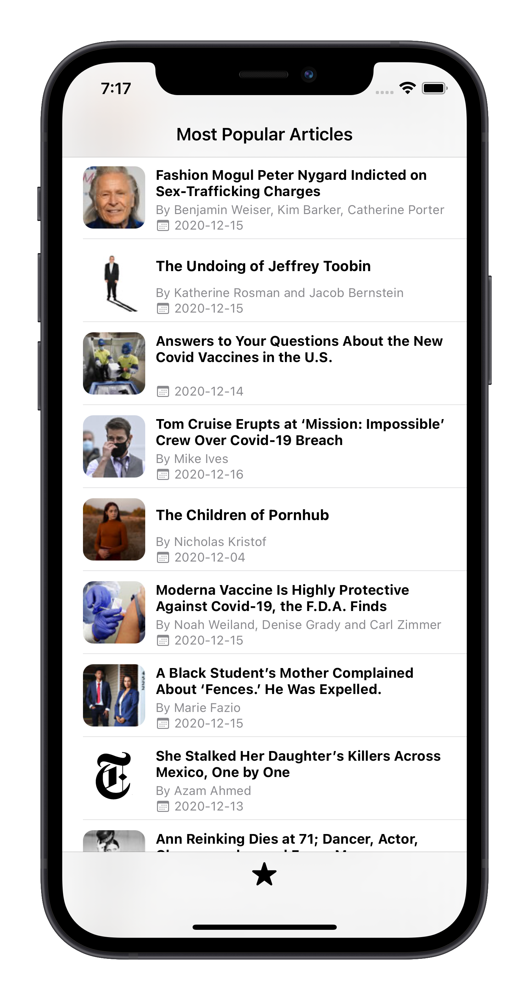
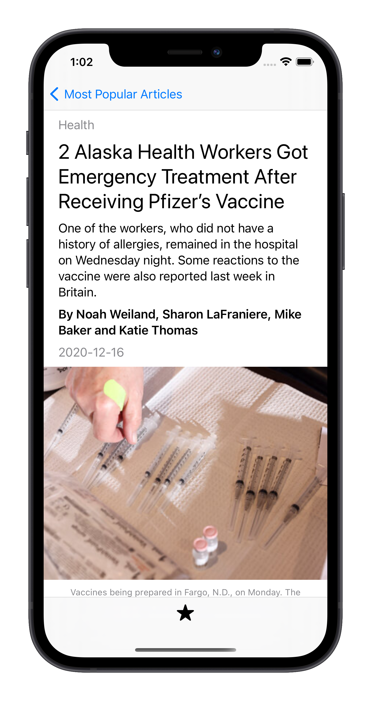

# NYTimesNews

    
    

NYTimesNews is a simple iOS app that fetches NYTimes Most Popular Articles and displays a list of them.

- Display a list of articles in a table view.
- When tapped; display article's details including: section, abstract, image and image caption.
- Support Dark Mode.
- Cache all images.
- [🛠 In Progress] Filter displayed articles.
- [🛠 In Progress] Search for a keyword or an article.
- [🛠 In Progress] Read article on NYTimes website.

## UI Design and Flow

I used the original design of NYTimes app as a refernece for Article's Details screen.

  

 

  
  

 

## UI Built Completely Programmatically 

I chose to build all UI elements programmatically for this app -though I really love Storyboards- because I wanted to build a complete app without a single Storyboard.

## Architecture 

The architecture used for this app is MVC-N. Classic Model-View-Controller with a Networking Manger to handle network calls. As the app is only a couple of screens, I thought MVC will suffice and be a good architecture for such small app. 

## Tools and Frameworks

- ❌ No third-party liabraries is used.
- 💯 UI is built 100% programmatically.
- Apple's XCTests for Unit and UI testing.